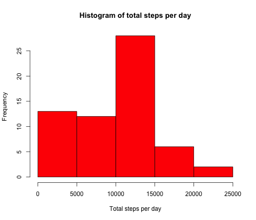
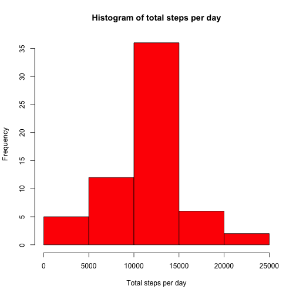
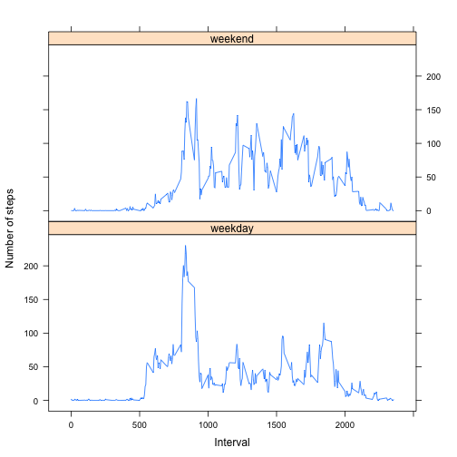

# Reproducible Research Peer Assessment 1


## Loading and preprocessing the data

```r
actDF <- read.csv("activity.csv", sep = ",", header = TRUE)
noNAactDF <- na.omit(actDF)
```


## What is mean total number of steps taken per day?

```r
dailyTotal <- sapply(split(noNAactDF$steps, noNAactDF$date), function(x) sum(x))
hist(dailyTotal, main = "Histogram of total steps per day", xlab = "Total steps per day", 
    col = "red")
```

 


* **Note that days with zero step due to NAs are included**

```r
mean(dailyTotal)
```

```
## [1] 9354
```

```r
median(dailyTotal)
```

```
## [1] 10395
```

The `mean` and `median` of total steps per day is 9354 and 10395 respectively.


## What is the average daily activity pattern?

```r
intervalVec <- sapply(split(noNAactDF$steps, noNAactDF$interval), function(x) mean(x))
plot(as.numeric(names(intervalVec)), intervalVec, type = "l", xlab = "5-min interval", 
    ylab = "mean steps during interval")
```

 


```r
names(intervalVec[intervalVec == max(intervalVec)])
```

```
## [1] "835"
```

At 835th interval, the mean steps is maximum.

## Imputing missing values
* The total number of rows with `NA`s:

```r
sum(is.na(actDF$steps))
```

```
## [1] 2304
```


* Strategy of fixing missing data: the missing values are replaced by the mean of same interval of all the other days when steps are available.

* The new dataset is created with missing values filled:

```r
avgSteps <- sapply(split(actDF$steps, actDF$interval), function(x) x[is.na(x)] <- as.integer(mean(x[!is.na(x)])))
for (i in 1:nrow(actDF)) {
    if (is.na(actDF[i, "steps"])) {
        actDF[i, "steps"] <- avgSteps[as.character(actDF[i, "interval"])][[1]]
    }
}
```


* The histogram, mean and median are plotted and calculated as below:

```r
dailyTotal <- sapply(split(actDF$steps, actDF$date), function(x) sum(x))
hist(dailyTotal, main = "Histogram of total steps per day", xlab = "Total steps per day", 
    col = "red")
```

 

```r
mean(dailyTotal)
```

```
## [1] 10750
```

```r
median(dailyTotal)
```

```
## [1] 10641
```

As we can see, `mean` and `median` increase after we fill the missing values. Part of zero counts are shifted to right bins. The bias is reduced by replacing `NA`s.

## Are there differences in activity patterns between weekdays and weekends?

```r
actDF$date <- as.Date(as.character(levels(actDF$date)[actDF$date]))
weekday <- weekdays(actDF$date)
weekday <- ifelse(weekday == "Sunday" | weekday == "Saturday", weekday <- "weekend", 
    weekday <- "weekday")
actDF$weekday <- as.factor(weekday)
intervalVec <- sapply(split(actDF$steps, actDF$interval), function(x) mean(x))
actDFwknd <- actDF[actDF$weekday == "weekend", ]
actDFwkd <- actDF[actDF$weekday == "weekday", ]
intervalVecwkd <- sapply(split(actDFwkd$steps, actDFwkd$interval), function(x) mean(x))
intervalVecwknd <- sapply(split(actDFwknd$steps, actDFwknd$interval), function(x) mean(x))
timeSerieswkd <- cbind(as.numeric(names(intervalVecwkd)), intervalVecwkd, "weekday")
timeSerieswknd <- cbind(as.numeric(names(intervalVecwknd)), intervalVecwknd, 
    "weekend")
timeSeriesDF <- as.data.frame(rbind(timeSerieswkd, timeSerieswknd))
names(timeSeriesDF) <- c("interval", "steps", "weekday")
timeSeriesDF$weekday <- as.factor(timeSeriesDF$weekday)
timeSeriesDF$interval <- as.numeric(levels(timeSeriesDF$interval)[timeSeriesDF$interval])
timeSeriesDF$steps <- as.numeric(levels(timeSeriesDF$steps)[timeSeriesDF$steps])
library("lattice")
xyplot(steps ~ interval | weekday, data = timeSeriesDF, layout = c(1, 2), type = "l", 
    xlab = "Interval", ylab = "Number of steps")
```

 

